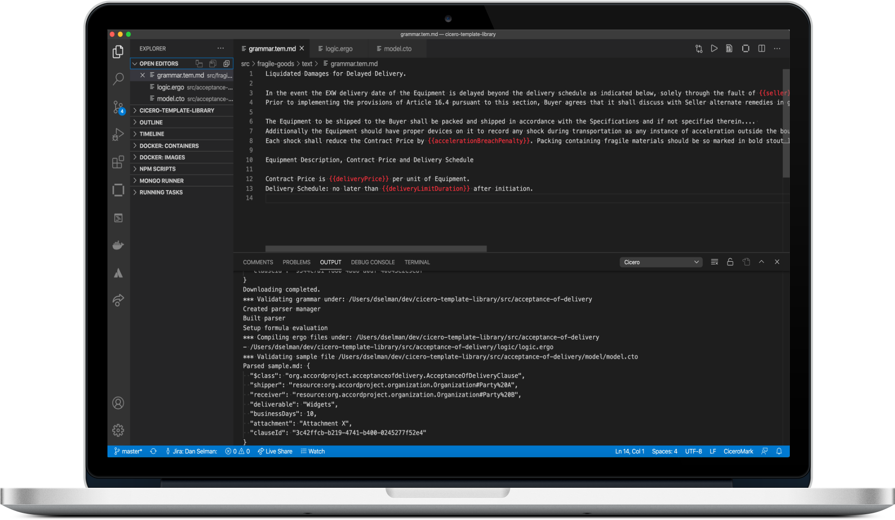

<h1 align="center">
  Accord Project Extension for VS Code
</h1>

<p align="center">
  <a href="https://marketplace.visualstudio.com/items?itemName=accordproject.cicero-vscode-extension"></a>
  <a href="https://marketplace.visualstudio.com/items?itemName=accordproject.cicero-vscode-extension"></a> <a href="https://github.com/accordproject/cicero-vscode-extension/blob/master/LICENSE"></a>
  <a href="https://accord-project-slack-signup.herokuapp.com/">
    
  </a>
</p>

The Accord Project extension helps developers to create, test and debug [Accord Project](https://accordproject.org) templates.

For a step-by-step guide on getting started with the extension's features, access our [VS Code Tutorial](https://docs.accordproject.org/docs/next/tutorial-vscode.html). For more comprehensive documentation, [follow this link.](https://docs.accordproject.org)



## Installation

Please visit the [Visual Studio Code Marketplace](https://marketplace.visualstudio.com/items?itemName=accordproject.cicero-vscode-extension) for installation and more details.

## Features

- Create data models for templates using the [Concerto](https://docs.accordproject.org/docs/model-concerto.html) modelling language
- Develop the logic for templates using the [Ergo](https://docs.accordproject.org/docs/logic-ergo.html) domain specific language
- Write the natural language text for templates using the [CiceroMark](https://docs.accordproject.org/docs/markup-cicero.html) extended markdown syntax
- Run unit tests for templates using the [Cucumber](https://cucumber.io) BDD testing framework
- Trigger templates (send them data and view the results)
- Syntax highlighting for all files
- Compilation and problem markers
- HTML preview for template markdown text and Concerto models

### Commands

- Work offline by downloading Concerto model dependencies (context-click on a `*.cto` file)
- Package templates into Cicero Template Archive (cta) files (context-click on root folder)
- Export PlantUML class diagram (context-click on a `*.cto` file)
- Trigger a template, parsing data from sample.md and passing in `request.json` and `state.json` (context-click on root folder)

### Views
- HTML preview for template text (open `grammar.tem.md` and then press the _Open Preview_ icon in the editor or context menu)
- HTML preview for Concerto models (open `*.cto` and then press the _Open Preview_ icon in the editor or context menu)

### Quick Fixes

- Add a variable to the template model if an undeclared variable is used in `grammar.tem.md`. _Note that the `model.cto` file must be open for the quick fix to be available._

### Concerto Snippets

The extention adds code snippets for the following elements of the Concerto language.

| Element     |   Prefix    |
| :---------- | :---------: |
| Asset       |    asset    |
| Participant | participant |
| Transaction | transaction |
| Concept     |   concept   |
| Enum        |    enum     |
| Event       |    event    |
| Namespace   |   namespace |
| Import      |    import   |
| String      |    string   |
| Double      |    double   |
| Integer     |    int      |
| Long        |    long     |
| DateTime    |    date     |
| Boolean     |    bool     |

### Ergo Snippets

The extention adds code snippets for the following elements of the Ergo language.

| Element     |   Prefix    |
| :---------- | :---------: |
| Clause      |   clause    |
| Contract    | contract    |

## Contact Us
If you have find any problems or want to make suggestions for future features please create [issues and suggestions on Github](https://github.com/accordproject/cicero-vscode-extension/issues). For any questions please [join](https://discord.com/invite/Zm99SKhhtA) the Accord Project Discord community and post questions to the `#technology-cicero` channel.

## Acknowledgments

Thanks to our friends at IBM Blockchain Platform for inspiring us with their [existing plugin](https://github.com/IBM-Blockchain/blockchain-vscode-extension/).

---

<p align="center">
  <a href="https://www.accordproject.org/">
    
  </a>
</p>

<p align="center">
  <a href="./LICENSE">
    
  </a>
  <a href="https://accord-project-slack-signup.herokuapp.com/">
    
  </a>
</p>

Accord Project is an open source, non-profit, initiative working to transform contract management and contract automation by digitizing contracts. Accord Project operates under the umbrella of the [Linux Foundation][linuxfound]. The technical charter for the Accord Project can be found [here][charter].

## Learn More About Accord Project

### [Overview][apmain]

### [Documentation][apdoc]

## Contributing

The Accord Project technology is being developed as open source. All the software packages are being actively maintained on GitHub and we encourage organizations and individuals to contribute requirements, documentation, issues, new templates, and code.

Find out what’s coming on our [blog][apblog].

Join the Accord Project Technology Working Group [Discord channel][apdiscord] to get involved!

For code contributions, read our [CONTRIBUTING guide][contributing] and information for [DEVELOPERS][developers].

### README Badge

Using Accord Project? Add a README badge to let everyone know: [](https://www.accordproject.org/)

```
[](https://www.accordproject.org/)
```

## License <a name="license"></a>

Accord Project source code files are made available under the [Apache License, Version 2.0][apache].
Accord Project documentation files are made available under the [Creative Commons Attribution 4.0 International License][creativecommons] (CC-BY-4.0).

Copyright 2018-2019 Clause, Inc. All trademarks are the property of their respective owners. See [LF Projects Trademark Policy](https://lfprojects.org/policies/trademark-policy/).

[linuxfound]: https://www.linuxfoundation.org
[charter]: https://github.com/accordproject/governance/blob/master/accord-project-technical-charter.md
[apmain]: https://accordproject.org/ 
[apblog]: https://medium.com/@accordhq
[apdoc]: https://docs.accordproject.org/
[apdiscord]: https://discord.com/invite/Zm99SKhhtA

[contributing]: https://github.com/accordproject/cicero-vscode-extension/blob/master/CONTRIBUTING.md
[developers]: https://github.com/accordproject/cicero-vscode-extension/blob/master/DEVELOPERS.md

[apache]: https://github.com/accordproject/cicero-vscode-extension/blob/master/LICENSE
[creativecommons]: http://creativecommons.org/licenses/by/4.0/